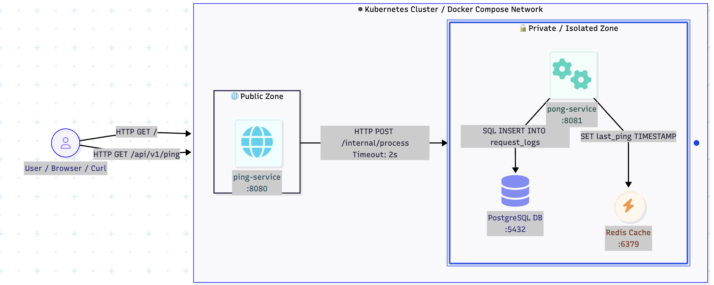

# Ping-Pong Microservices Architecture (Kubernetes & Helm)

  

---

## 🇹🇷 Türkçe README

Bu proje, Kubernetes ortamında çalışmak üzere tasarlanmış; yüksek erişilebilirlik (HA), otomasyon, güvenlik ve yatay ölçeklenebilirlik (HPA) ilkelerine dayalı production-ready bir mikroservis mimarisidir. Go diliyle yazılmış `ping-service` ve `pong-service` uygulamalarının, kalıcı veri saklama (PostgreSQL) ve önbellekleme (Redis) katmanlarıyla olan senkron iletişimini kapsar.

### 🏗️ Mimari ve Sistem Tasarımı

Proje mimarisi **Network Isolation** ilkelerine uygun olarak iki temel alana ayrılmıştır:

1. **🌐 Public Zone:**
   * **`ping-service` (:8080):** Dış dünyadan gelen `HTTP GET /` ve `HTTP GET /api/v1/ping` isteklerini karşılayan ana giriş noktasıdır.
2. **🔒 Private / Isolated Zone (İzole Katman):**
   * **`pong-service` (:8081):** Dış erişime kapalıdır. `ping-service` tarafından gönderilen `HTTP POST /internal/process` isteklerini kabul eder (`2s` timeout).
   * **`PostgreSQL DB` (:5432):** `pong-service` tarafından gelen log verilerini işler (`SQL INSERT INTO request_logs`).
   * **`Redis Cache` (:6379):** `pong-service` tarafından son işlem zamanını saklar (`SET last_ping TIMESTAMP`).

---

### 🌟 Öne Çıkan Mühendislik Standartları

* **Parametrik Helm Chart Yapısı:** Tüm Kubernetes manifestleri (`Deployments`, `StatefulSet`, `Services`, `ConfigMaps`, `Secrets`, `HPA`) parametrik hale getirilerek `values.yaml` üzerinden dinamik olarak yönetilmektedir.
* **Horizontal Pod Autoscaling (HPA):** `ping-service` ve `pong-service` için metrik tabanlı CPU kullanımı (%70 eşiği) izlenerek replika sayıları yük durumuna göre otomatik olarak 2 ile 3 arasında ölçeklenir.
* **Gelişmiş Health Probe Katmanı:**
  * **`startupProbe`:** PostgreSQL gibi Stateful servislerin açılış/recovery süreçlerinde Kubernetes tarafından erken sonlandırılmasını engeller (`pg_isready`).
  * **`readinessProbe`:** Uygulama tamamen hazır olana kadar trafiğin Pod'a yönlendirilmesini engeller (Zero-Downtime).
  * **`livenessProbe`:** Kilitlenen (Deadlock) veya yanıt vermeyen Pod'ları tespit ederek otomatik yeniden başlatır (Self-Healing).
* **Graceful Shutdown:** `preStop` hook'ları sayesinde rolling update sırasında aktif HTTP bağlantılarının yarım kalması engellenmiştir.
* **Veri Kalıcılığı (Persistence):** PostgreSQL `StatefulSet` ve `PersistentVolumeClaim` (PVC) kullanılarak Pod silinme/çökme senaryolarında veri kaybı %100 engellenmiştir.
* **Sıkılaştırılmış Kaynak Güvenliği:** Her Pod için `resources.requests` / `limits` değerleri ve non-root `securityContext` tanımlanmıştır.

---

### 🛠️ Teknolojiler

* **Programming Language:** Go (Golang)
* **Containerization:** Docker
* **Orchestration:** Kubernetes (Minikube / Multi-Node Cluster Topology)
* **Package Manager:** Helm v3
* **Databases:** PostgreSQL 15 (Relational), Redis (In-Memory Cache)

---

### 🚀 Kurulum ve Çalıştırma Adımları

#### Ön Gereksinimler
* Docker & Minikube
* `kubectl` CLI
* Helm v3
* Make (İsteğe bağlı)

#### 1. Cluster Topology ve Namespace İzolasyonu

# Cluster konfigürasyonunu ve namespace izolasyonunu başlatın
bash scripts/cluster-setup.sh
2. Helm ile Deploy Etme
Bash
# Helm bağımlılıklarını güncelleyip dağıtımı yapın
make deploy

# Manuel Helm dağıtımı için:
helm upgrade --install ping-pong-app ./deployments -n ping-pong
3. Servislere Erişme (Local Port-Forwarding)
Bash
# Ping servisi tünelleme (Public Zone)
kubectl port-forward svc/ping-pong-app-hepapi-case-ping-service 8080:8080 -n ping-pong

# Pong servisi tünelleme (İzole Katman Debug İçin)
kubectl port-forward svc/ping-pong-app-hepapi-case-pong-service 8081:8081 -n ping-pong
🧪 Yük ve Autoscaling (HPA) Testi
HPA mekanizmasının ping ve pong servislerini eşzamanlı olarak 3 replikaya çıkardığını doğrulamak için paralelleştirilmiş yük testi:

Bash
# 10 eşzamanlı döngü ile yük bindirme
while true; do curl -s http://localhost:8080/ping > /dev/null; done &
Canlı HPA ve Pod ölçeklenmesini izlemek için:

Bash
kubectl get hpa -n ping-pong -w

🇬🇧 English README
This repository contains a production-ready, highly available, and fault-tolerant microservices architecture engineered for Kubernetes. It features Go-based ping-service and pong-service applications communicating synchronously, backed by PostgreSQL for stateful persistence and Redis for caching.

🏗️ Architecture & System Design
The system enforces strict Network Zone Isolation:

🌐 Public Zone:

ping-service (:8080): Serves as the public ingress interface handling HTTP GET / and HTTP GET /api/v1/ping endpoints.

🔒 Private / Isolated Zone:

pong-service (:8081): Internal microservice. Receives synchronous HTTP POST /internal/process calls (2s timeout) from ping-service.

PostgreSQL DB (:5432): Handles relational persistence (SQL INSERT INTO request_logs).

Redis Cache (:6379): Maintains transient application state (SET last_ping TIMESTAMP).

🌟 Core Architectural Features
Parameterized Helm Architecture: Complete templating of Kubernetes manifests (Deployments, StatefulSet, Services, ConfigMaps, Secrets, HPA) driven via values.yaml.

Horizontal Pod Autoscaling (HPA): Metrics-driven autoscaling based on target CPU utilization (70%), dynamically scaling replicas between 2 and 3.

Advanced Health Probing:

startupProbe: Utilized on PostgreSQL (pg_isready) to accommodate long WAL recovery phases without triggering premature kills.

Aggressive readinessProbe for zero-downtime traffic distribution and livenessProbe for self-healing deadlocks.

Graceful Shutdown: Integrated preStop lifecycle hooks to process inflight requests during rolling deployments.

Durable Persistence: Uses PostgreSQL StatefulSet bound to PersistentVolumeClaim (PVC) guaranteeing zero data loss across pod destructions.

Resource Hardening: Explicit resources.requests / limits paired with non-root securityContext boundaries.

🛠️ Tech Stack
Programming Language: Go (Golang)

Containerization: Docker

Orchestration: Kubernetes (Minikube / Multi-Node Cluster Topology)

Package Manager: Helm v3

Databases: PostgreSQL 15 (Relational), Redis (In-Memory Cache)

🚀 Getting Started
Prerequisites
Docker & Minikube

kubectl CLI

Helm v3

Make (Optional)

1. Cluster Setup & Isolation
Bash
# Provision cluster topology and namespace isolation
bash scripts/cluster-setup.sh
2. Deploy via Helm
Bash
# Deploy release using Makefile target
make deploy

# Or via Helm CLI:
helm upgrade --install ping-pong-app ./deployments -n ping-pong
3. Exposing Services (Local Port-Forwarding)
Bash
# Port-forward Ping service (Public Zone)
kubectl port-forward svc/ping-pong-app-hepapi-case-ping-service 8080:8080 -n ping-pong

# Port-forward Pong service (Internal Debugging)
kubectl port-forward svc/ping-pong-app-hepapi-case-pong-service 8081:8081 -n ping-pong
🧪 Stress & Autoscaling (HPA) Validation
To validate synchronous scale-up behavior on both ping and pong deployments under load:

Bash
# Spawn 10 concurrent HTTP worker loops
for i in {1..10}; do (while true; do curl -s http://localhost:8080/ping > /dev/null; done &); done
Monitor real-time HPA metric thresholds:

Bash
kubectl get hpa -n ping-pong -w